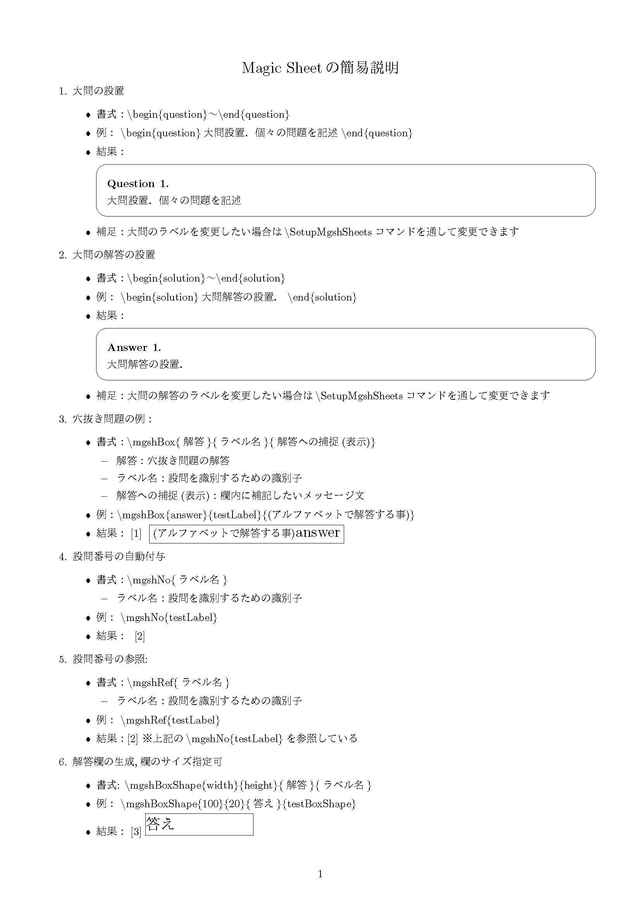

Magic Sheet
=====

Summary/要約
----

### Japanese
穴埋め問題を含む問題の解答の表示/非表示を切り換える機能を提供するLaTeX用試験作成支援パッケージです．

### English
This latex style file provides you to switch easily visible / invisible answer for question you made. The latex style file will result in improvement of cost performance according to support to share answer with co-author for making exams. The advantage of this package is easily to switch answer visible / invisible by one command, which includes grand question and cloze and so on. In addition, this package provides a function to make title for routine exam in Okayama Shoka University. The function is based on exsheets package so that you can use more functions via the exsheets.  

Bug
---

- [English] Please insert a empty row into next `\IsVisible` command. If not, an error will be occurred.
- [Japanese] `IsVisible`コマンドの次の行に空白行を入れて下さい. さもなければ，エラーが発生します．

## Explanation / 説明

- The latex source code which generated this image can be gotton from example-mgsh.tex

## Published
本パッケージは次の文献にて出典しております．
- 箕輪弘嗣, Magic Sheet:穴埋め問題などに対応した解答の一括非表示が可能な問題作成支援LaTeXスタイルファイル, 岡山商科大学論叢, 第53巻, 第3号, pp.25-43, 2018.3.
